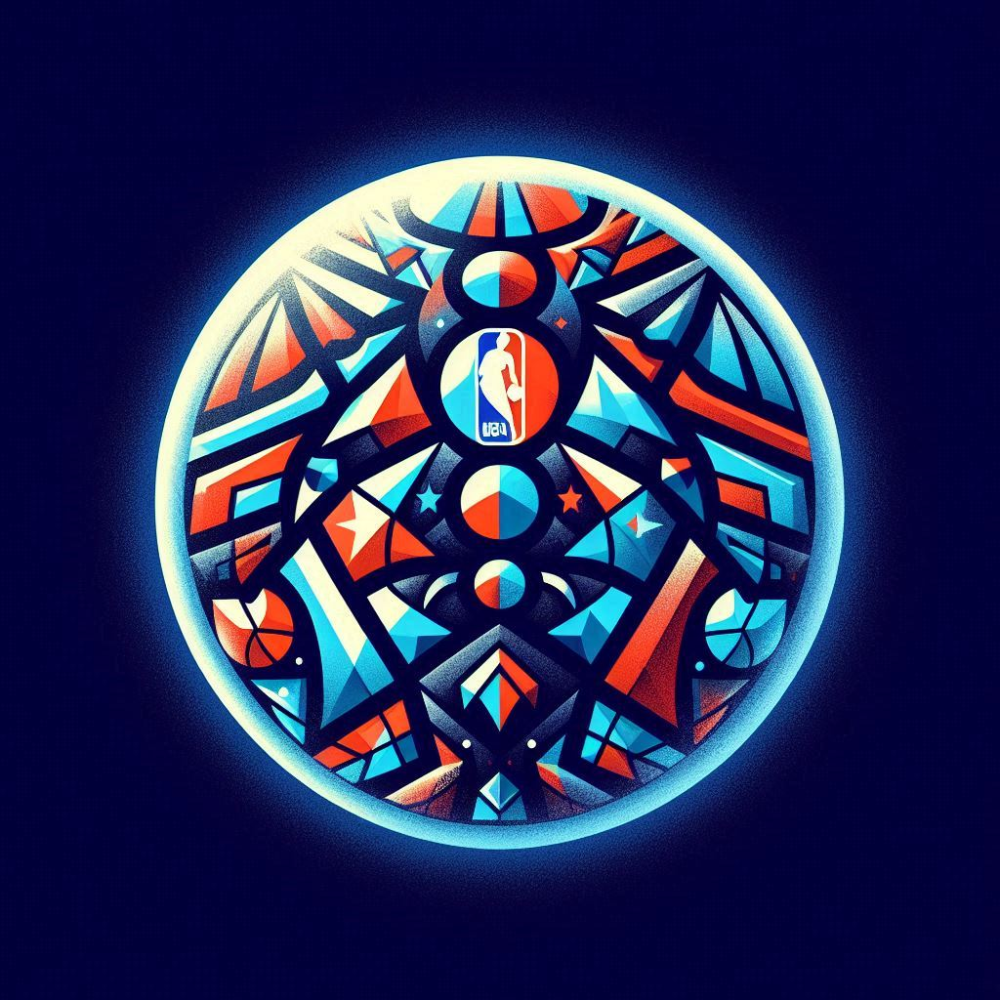
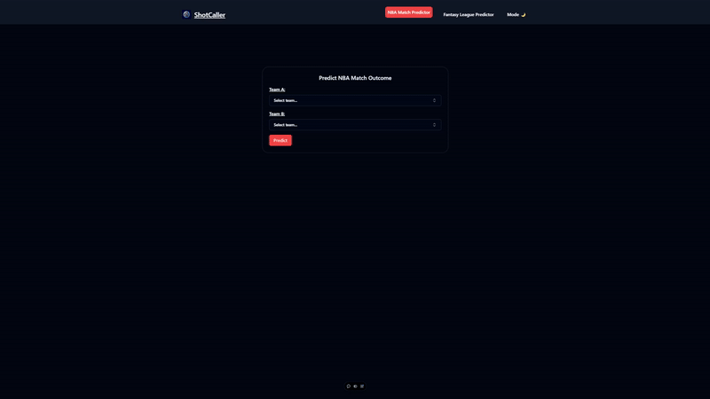

# ShotCaller

  

Live Site: [ShotCaller](https://shot-caller-five.vercel.app)

## Table of Contents

- [Overview](#overview)
- [Technologies](#technologies)
- [Libraries & Methodologies](#libraries--methodologies)
- [Features](#features)
- [TODOS/Features to Implement](#todosfeatures-to-implement)
- [Author Info](#author-info)

---

## Overview

Welcome to **ShotCaller**, a predictive webapp designed for basketball enthusiasts and fantasy league players. Using NBA player and match data, the app provides highly accurate predictions for NBA games and fantasy matchups.

[Back to Top](#shotcaller)

---

## Technologies

- **Backend:** Flask, Python
- **Frontend:** Vite, TypeScript
- **Data Processing:** Pandas, Beautiful Soup
- **Database:** PostgreSQL
- **Machine Learning:** Scikit-learn

[Back to Top](#shotcaller)

---

## Libraries & Methodologies

- **Web Scraping:** Beautiful Soup for extracting NBA data.
- **Data Processing:** Pandas for cleaning and preparing datasets.
- **Machine Learning:** Random forest algorithm for predictions.

[Back to Top](#shotcaller)

---

## Features

- **Match Outcome Predictions**: Predict match outcomes of NBA or fantasy league games based on user input of teams or players!

  

[Back to Top](#shotcaller)

---

## TODOS/Features to Implement

- [ ] Integrate authentication to allow users to save their teams.
- [ ] Expand dataset to include additional leagues and seasons.
- [ ] Improve app design for easier usability.

[Back to Top](#shotcaller)

---

## Author Info

Created by:  
**Azim Rahat** - [Portfolio](https://azimrahat.com) | [LinkedIn](https://linkedin.com/in/azim-rahat)

[Back to Top](#shotcaller)
